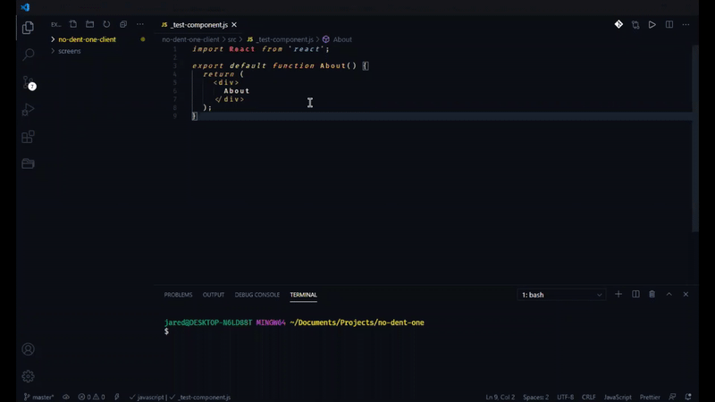

# React Snippet Generator

Select an installed React component library to generate up to 3 types of VS Code snippets.

Check out my other extension which shows a list of your components on the sidebar, and allows you to add them to your code with a single click.

[React Component Explorer](https://marketplace.visualstudio.com/items?itemName=ObsessiveCoder.react-component-explorer)

# Usage

1. Use `ctrl + shift + P` and select the command `React Snippet Generator: Generate Component Snippets`.
2. Type in the name of the library. This is used to name the file.
3. Select the types of snippets to generate.
4. Select the folder where the component library is installed.

# Coming Soon

* Unit tests
* Change Log
* Right click a folder for a context option to generate snippets for components found in that folder.

# Known Issues

Attempting to read too many files will cause the generator to be cancelled.
